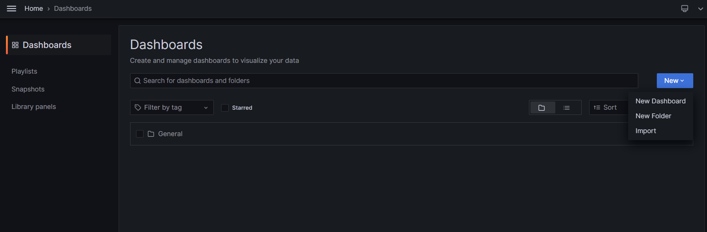
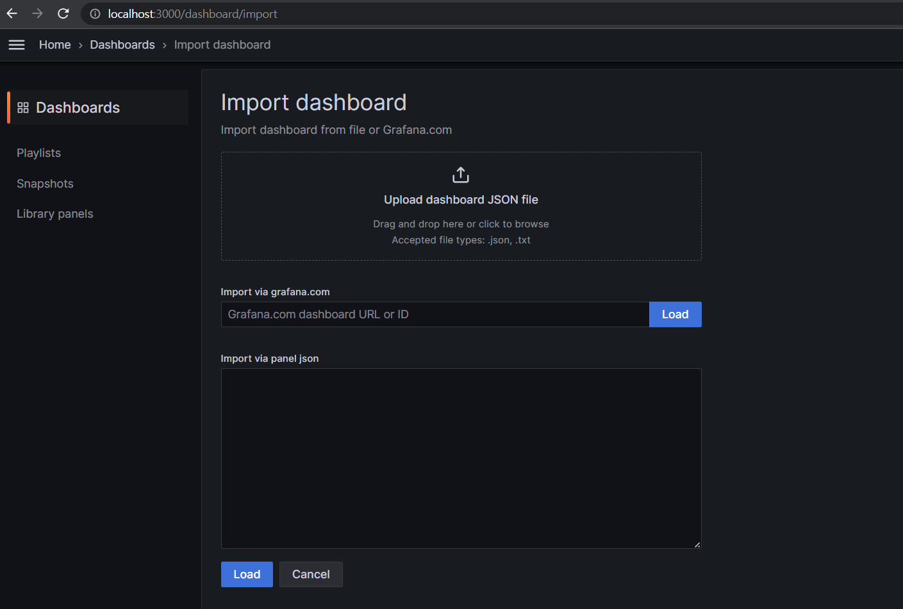
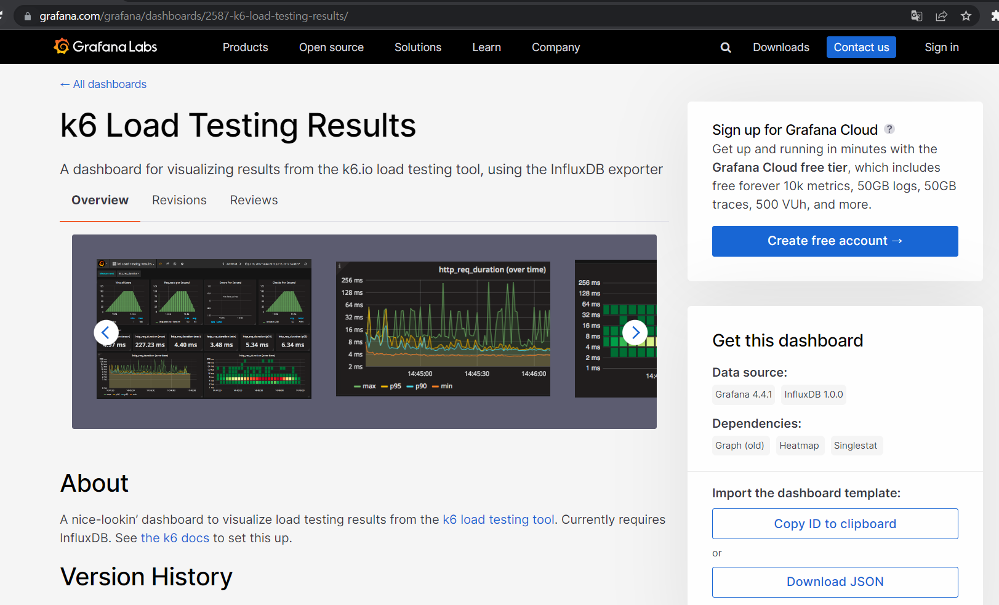
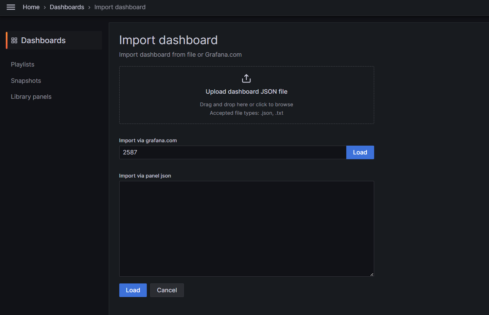
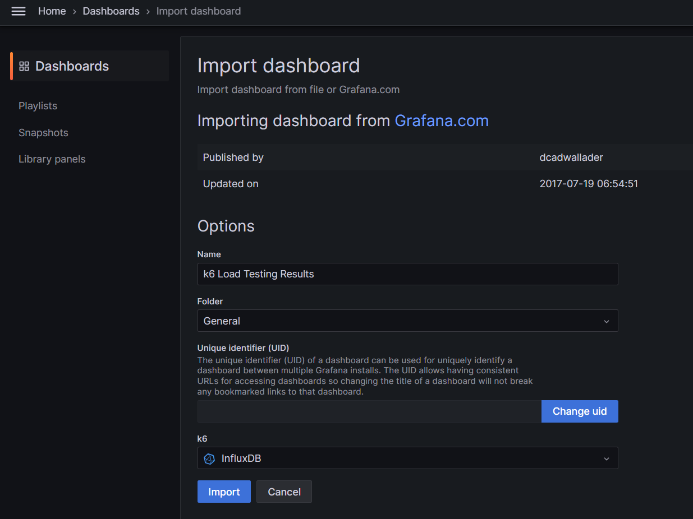
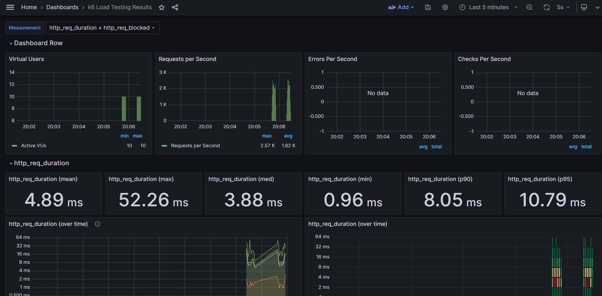

# Redis

+ 공식 레퍼런스: https://redis.io/
+ 클라이언트 레퍼런스 URL: https://redis.io/docs/clients/

+ CLI: https://redis.io/commands/

+ configuration: https://redis.io/docs/management/config/
  + 2023-06-18 기준 최신 버전: 7.0
    + https://raw.githubusercontent.com/redis/redis/7.0/redis.conf

<br>

# k6

+ 컨테이너 이미지: `loadimpact/k6`

+ 아래와 같이 실행합니다.
```bash
$ docker compose run --rm k6 run /scripts/test.js
```

<br>

# InfluxDB

+ 1.8 버전 공식 레퍼런스: https://docs.influxdata.com/influxdb/v1.8/

<br>

# Grafana

+ 그라파나 대시보드 화면에서 좌측 사이드 바 아이콘을 클릭 후, `Dashboards > new > import` 를 통해 아래와 같은 화면으로 이동합니다.





+ k6 대시보드: https://grafana.com/grafana/dashboards/2587-k6-load-testing-results/



위 웹 페이지의 우측 하단 매뉴에서, `Import the dashboard template` 의 `Copy ID to clipboard` 버튼을 클릭합니다.

아래와 같이, `Import via grafana.com`의 input으로 복사한 ID를 붙여넣고 `Load` 버튼을 클릭합니다.



아래와 같이, 하단 메뉴인 `k6`에서 `InfluxDB`를 선택하고 `Import` 버튼을 클릭합니다. 



아래와 같이 커맨드를 실행한 후 대시보드를 확인합니다. <br>
influxdb의 IP는, docker compose 명령을 통해 실행되는 로그를 통해 확인하실 수 있습니다.
```bash
docker compose run --rm k6 run /scripts/test.js -o influxdb=http://${INFLUXDB-IP}:8086/k6
```


# MariaDB

+ 환경변수 및 도커 컴포즈 파일 작성 예시 참고: https://hub.docker.com/_/mariadb 
